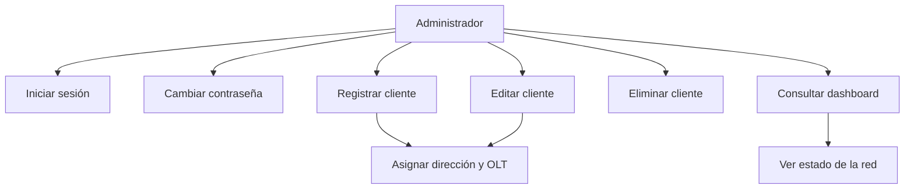

# Diagrama de casos de uso

## Actores
- Administrador
- Usuario del sistema

## Casos de uso principales
1. Iniciar sesión
2. Cambiar contraseña
3. Registrar cliente
4. Editar cliente
5. Eliminar cliente
6. Consultar dashboard
7. Ver detalles de la OLT y dirección asociada

